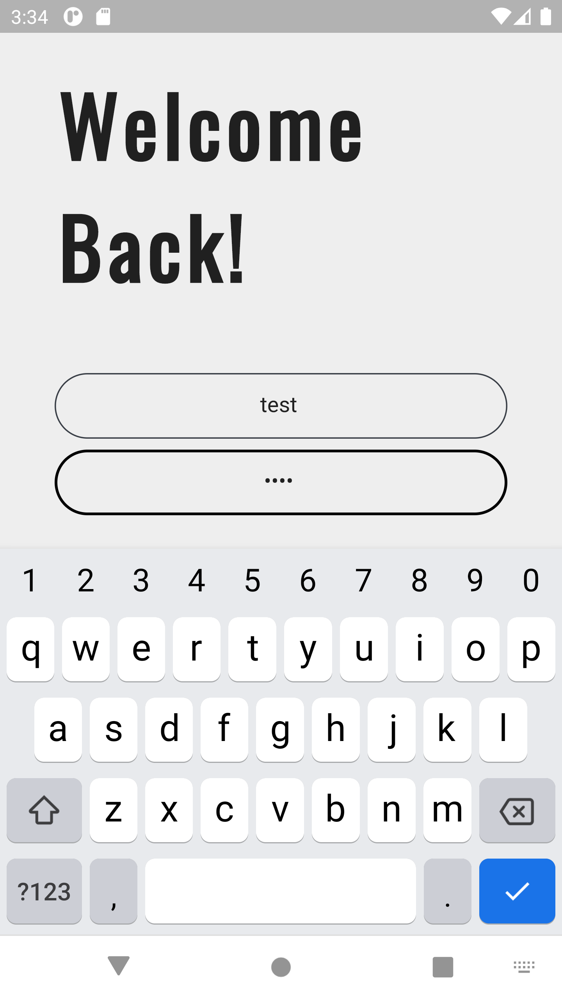
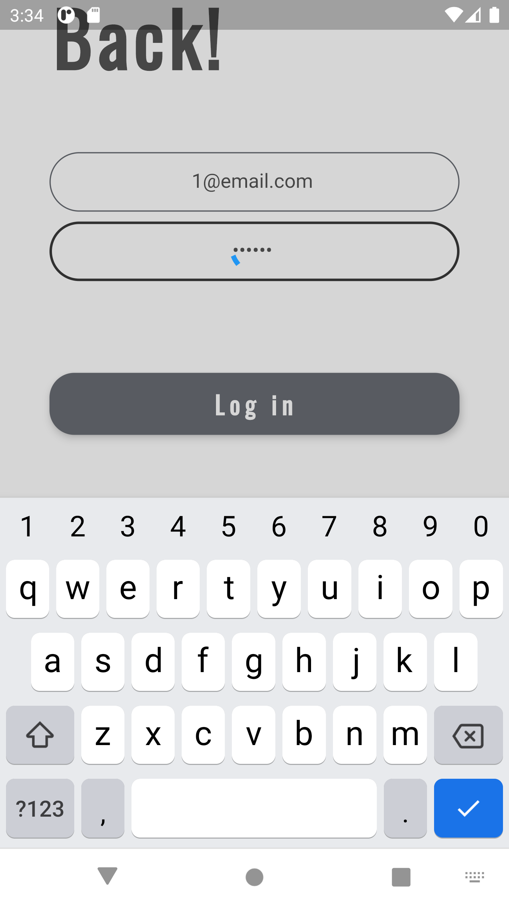
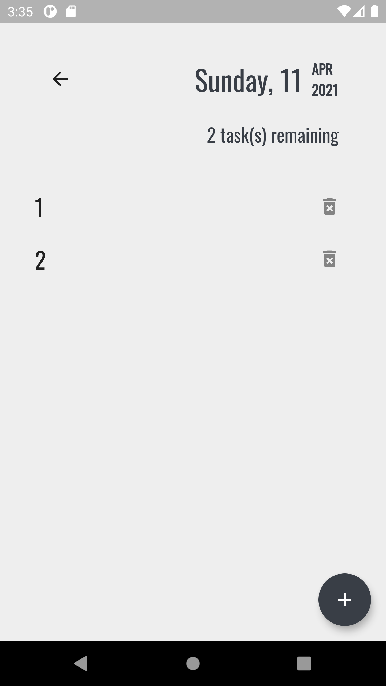

# weather_checker

Weather Checker made with Flutter

Screenshots below ran on the Nexus 6 virtual device, not yet tested on an iOS device

Font : <a href="https://fonts.google.com/specimen/Oswald?query=oswald">Oswald</a>

<h2>Startup Screen</h2>

 
<h2>Login Screen</h2>

 
<h2>Register Screen</h2>

 
<h2>Example input</h2>

<h2>Loading</h2>

<h2>Functionality</h2>

<h2>After erasing</h2>

<h2>Adding tasks</h2>

